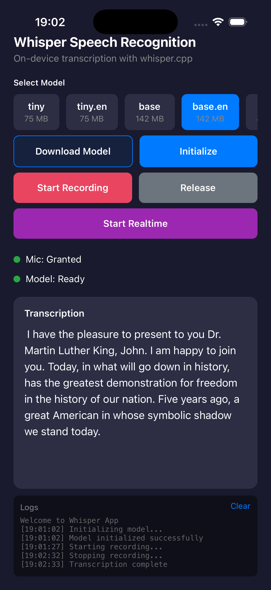

# expo-whisper

Fast, private speech-to-text for React Native and Expo. Everything runs on your phone, no servers, no waiting, no cloud bills.



## What You Get

- Speech-to-text that runs entirely on-device (no internet required)
- Real-time transcription from your microphone
- Transcribe audio files or raw audio buffers
- 12 models to choose from (75MB tiny model up to 3.1GB for best accuracy)
- Models auto-download from HuggingFace and cache locally
- Works on both iOS and Android
- GPU acceleration when available
- Full TypeScript support

## Installation

This is a local Expo module in the whisperapp project. It's linked in `package.json` like this:

```json
"expo-whisper": "file:./modules/expo-whisper"
```

Import it in your code:

```typescript
import { useWhisper, downloadModel, getModelPath } from 'expo-whisper';
```

### You'll Need These Dependencies

```bash
npm install expo-file-system react-native-quick-base64
```

The `react-native-quick-base64` package is native code that handles audio encoding/decoding way faster than the JavaScript version.

### iOS: Add Microphone Permissions

Drop this in your `app.json`:

```json
{
  "expo": {
    "ios": {
      "infoPlist": {
        "NSMicrophoneUsageDescription": "Microphone access is required for speech-to-text transcription"
      }
    }
  }
}
```

### Android: Permissions Are Already Handled

Android permissions happen automatically, so you don't need to do anything.

## Building It

Since this includes native code (`expo-whisper`), you need to prebuild:

```bash
npm install
npx expo prebuild --clean
```

Then run it on a device:

```bash
# iOS
npx expo run:ios

# Android
npx expo run:android
```

**Important:** `npx expo start` (the dev server) won't work with native modules. You must use `prebuild` + `run:ios/android` to actually run the app.

## Quick Start

### Getting a Model

Models are stored locally on your device and download from [HuggingFace](https://huggingface.co/ggerganov/whisper.cpp) the first time you need them.

```typescript
import { Whisper, downloadModel, getModelPath, isModelDownloaded } from 'expo-whisper';

// Check if you already have it
const exists = await isModelDownloaded('tiny');

if (!exists) {
  // Download it (about 75MB for the tiny model)
  await downloadModel('tiny', (progress) => {
    console.log(`Download: ${Math.round(progress * 100)}%`);
  });
}

// Get the local path and fire it up
const modelPath = await getModelPath('tiny');
const whisper = await Whisper.initialize({
  modelPath,
  useGpu: true
});
```

**Available Models**:
- tiny (75MB) - fast, works on anything
- base (142MB) - good balance
- small (466MB) - pretty accurate
- medium (1.5GB) - very accurate
- large-v3 (3.1GB) - best possible accuracy

## How to Use It

### Two Ways In

**Without React** (just plain JavaScript/TypeScript):
```typescript
import { Whisper } from 'expo-whisper';

const whisper = await Whisper.initialize({ modelPath });
const task = await whisper.transcribeFile(path);
console.log(task.result?.text);
```

**React Hook** (way easier for React apps):
```typescript
import { useWhisper } from 'expo-whisper';

const { transcribeFile, progress, result } = useWhisper({ modelPath });
```

### One Instance to Rule Them All

The `Whisper` class is a singleton. Call `initialize()` twice and you get the same object back:

```typescript
const w1 = await Whisper.initialize({ modelPath });
const w2 = await Whisper.initialize({ modelPath });
// w1 === w2 ✓

// If you want a fresh one, release first
await w1.release();
const w3 = await Whisper.initialize({ modelPath });  // New instance
```

### You Get Tasks Back, Not Just Results

Every transcription method returns a `TranscriptionTask` that you can track:

```typescript
const task = await whisper.transcribeFile(path);

// Check how it's going
console.log(task.progress);        // 0-100
console.log(task.status);         // 'processing', 'complete', error, etc.

// Get the actual transcription
console.log(task.result?.text);         // Full text
console.log(task.result?.segments);     // Individual words with timings

// Change your mind? Cancel it
await task.cancel();
```

### Recording: Two Styles

If you're recording from the microphone:

| Method | Best For |
|--------|----------|
| `startRecording()` + `stopRecording()` | When you need full control (track progress, cancel mid-recording) |
| `recordAndTranscribe()` | Simple case where you just want to record and get text back |

Pick whichever fits your flow.

### Handling Errors

Wrap your transcription in a try-catch:

```typescript
try {
  const task = await whisper.transcribeFile(path);
  console.log(task.result?.text);
} catch (error) {
  console.error('Something went wrong:', error);
}
```

Or check the task status after it finishes:

```typescript
const task = await whisper.transcribeFile(path);
if (task.status === 'error') {
  console.error('Transcription failed:', task.error?.message);
}
```

### Managing Tasks in Memory

Tasks stick around in memory until you clean them up:

```typescript
// See what's currently running
const active = whisper.getActiveTasks();

// Get some stats
const stats = whisper.getStats();
// { active: 0, total: 5, completed: 4, failed: 1 }

// Clean up tasks older than 1 hour (in milliseconds)
whisper.cleanupCompletedTasks(3600000);

// Or just clear everything that's done
whisper.clearCompletedTasks();
```

### Real-time Transcription

For live transcription from the mic:

```typescript
await whisper.startRealtime(300, {
  language: 'en',
  onSegment: (segment) => console.log(segment.text)
});

// Check state whenever you want
console.log(whisper.isRealtimeActive());      // true/false
console.log(whisper.getRealtimeText());       // what you've said so far
console.log(whisper.getRealtimeSegments());   // individual words

// Stop and get final result
const task = await whisper.stopRealtime();
console.log(task.result?.text);
```

**Note on Accuracy:** Real-time transcription trades accuracy for responsiveness. It processes audio in chunks to give instant feedback, so it sees less context than batch transcription. For better accuracy, use `recordAndTranscribe()` or record audio first then transcribe with `transcribeBuffer()`.

## API Reference

For the full, detailed API docs, check out [modules/expo-whisper/README.md](./modules/expo-whisper/README.md).

### The Whisper Class (If You're Not Using React)

```typescript
import { Whisper } from 'expo-whisper';

// Fire it up
const whisper = await Whisper.initialize({ modelPath, useGpu: true });

// Transcribe files or audio buffers
const fileTask = await whisper.transcribeFile(path, options);
const bufferTask = await whisper.transcribeBuffer(buffer, options);

// Record from microphone
await whisper.startRecording();
const recordingTask = await whisper.stopRecording();

// Live transcription
await whisper.startRealtime(300, { onSegment, onAudioLevel });
const realtimeTask = await whisper.stopRealtime();

// Manage what's running
whisper.getTask(taskId);
whisper.getActiveTasks();
whisper.getStats();
whisper.cleanupCompletedTasks();

// Clean up when you're done
await whisper.release();
```

### useWhisper Hook (React Apps)

```typescript
import { useWhisper } from 'expo-whisper';

const {
  transcribeFile,
  transcribeBuffer,
  progress,
  result,
  error,
  isLoading,
  segments,
  cancel,
  reset,
} = useWhisper({ modelPath, language: 'en' });

// Now use these in your component
await transcribeFile(path);
console.log(result?.text);
```

### useRealtimeTranscription Hook (React)

For live mic transcription in React components:

```typescript
const {
  isRecording,
  startRecording,
  stopRecording,
  segments,
  interimText,
  metrics,
} = useRealtimeTranscription({ modelPath });
```

### Transcription Options

You can tweak how transcription works:

```typescript
{
  language: 'en' | 'auto' | ...     // What language to expect
  temperature: number               // How "creative" the model is (0 = exact, 1+ = random)
  translate: boolean                // Translate result to English (if the audio isn't in English)
  maxTokens: number                 // Limit output length
  suppressBlank: boolean            // Filter out silence
  suppressNst: boolean              // Filter out special markers like [noise]
  onProgress: (p: number) => void   // Callback as it processes (0-100)
  onSegment: (s: Segment) => void   // Callback for each word/phrase
}
```

### Managing Models

Models come from [HuggingFace](https://huggingface.co/ggerganov/whisper.cpp). They download and cache locally:

```typescript
import {
  downloadModel,
  isModelDownloaded,
  getModelPath,
  deleteModel,
  MODEL_SIZES,
} from 'expo-whisper';

// Do you have it?
if (!await isModelDownloaded('tiny')) {
  // Nope, get it
  await downloadModel('tiny', (progress) => {
    console.log(`Downloading: ${(progress * 100).toFixed(0)}%`);
  });
}

// Where is it?
const path = await getModelPath('tiny');

// Need the space back? Delete it
await deleteModel('tiny');

// What's available?
console.log(MODEL_SIZES); // ['tiny', 'base', 'small', ...]
```

### All Available Models

| Model | Size | Use When... |
|-------|------|-------------|
| tiny | 75 MB | Speed matters (mobile, low-end devices) |
| tiny.en | 75 MB | Just English, fastest possible |
| base | 142 MB | Good speed + accuracy balance |
| base.en | 142 MB | Just English, balanced |
| small | 466 MB | Want better accuracy |
| small.en | 466 MB | Just English, pretty accurate |
| medium | 1.5 GB | High accuracy (need a decent phone) |
| medium.en | 1.5 GB | Just English, high accuracy |
| large-v1 | 2.9 GB | Best accuracy (flagship phones only) |
| large-v2 | 2.9 GB | Best accuracy (flagship phones only) |
| large-v3 | 3.1 GB | Best accuracy, latest version |
| large-v3-turbo | 1.6 GB | Best accuracy but faster than large |

Models get cached in `Documents/whisper-models/` on iOS and your app's documents folder on Android.

## Fine-Tuning Transcription

### Beam Search for Better Accuracy

```typescript
const task = await whisper.transcribeFile(path, {
  language: 'en',
  temperature: 0.3,      // 0 = it's super literal, 1+ = it gets creative
  beamSize: 5,           // search more possibilities (slower but more accurate)
  translate: true,       // convert result to English
});
```

### Voice Activity Detection (Filtering Out Noise)

VAD filters your output so you get cleaner transcriptions:

**`suppressBlank`** (default: on)
- `true`: Removes silence - only actual speech
- `false`: Includes empty spots between words

**`suppressNst`** (default: on)
- `true`: Clean, professional output (recommended for apps)
- `false`: Includes special markers like [silence] and [noise]

**What should you use?**

```typescript
const task = await whisper.transcribeFile(path, {
  suppressBlank: true,   // Filter out silence
  suppressNst: true,     // Filter out special markers
});
```

| Use Case | suppressBlank | suppressNst | Result |
|----------|--------------|------------|--------|
| Production app | true | true | Just the words |
| Debugging | false | false | Everything, including markers |
| Transcription with context | false | true | All words, no markers |
| Aggressive filtering | true | false | Filtered silence + markers |

### Getting Callbacks as You Go

Want progress updates or individual words as they're processed?

```typescript
const task = await whisper.transcribeFile(path, {
  language: 'en',
  onProgress: (progress) => console.log(`Done: ${progress}%`),
  onSegment: (segment) => {
    console.log(`${segment.start}s - ${segment.end}s: "${segment.text}"`);
  },
});
```

## See It in Action

Check out [App.tsx](./App.tsx) for a working example. It shows how to:
- Transcribe files
- Transcribe audio buffers
- Do real-time streaming
- Cancel transcriptions mid-process
- Handle errors properly

## How It Works on Each Platform

### iOS

- Models live in: `Documents/whisper-models/`
- Audio format: WAV (16-bit PCM, 16kHz, mono)
- Uses Metal GPU acceleration
- Needs permission: NSMicrophoneUsageDescription

### Android

- Models in the app's documents folder
- Audio format: WAV (platform encoding)
- Uses NNAPI GPU acceleration
- Permissions handled automatically

## Making It Fast

- **Pick the right model**: tiny and base are blazing fast, large models are more accurate
- **Enable GPU**: Set `useGpu: true` when initializing (it's automatic when available)
- **Clean up**: Call `whisper.release()` when you're done to free memory
- **Models cache locally**: After download, they're super fast to use
- **Real-time transcription**: Use smaller models (tiny/base) for responsive live transcription

## Stuck? Try These

### Model Won't Download

Check your internet connection and make sure you have space on the device.

### Can't Initialize

Check that the model file actually exists:

```typescript
const path = await getModelPath('tiny');
const exists = await isModelDownloaded('tiny');
```

### Transcription Is Slow

- Try a smaller model (tiny or base are quick)
- Make sure GPU is enabled: `useGpu: true`
- Check if your device has enough RAM
- Real-time mode might feel faster for live input

### Microphone Issues

**"Recording doesn't work"**
- Check permissions: `await requestMicrophonePermissions()`
- Test with the Voice Memos app to verify the mic works
- Check your native logs to see if audio is being captured

**"Real-time isn't showing words"**
- Check that `onSegment` callback is actually set up
- Make sure `suppressBlank` and `suppressNst` aren't filtering everything out
- Look at WhisperContext.swift NSLog statements to see if the callback is firing

## TypeScript Types

If you want to type your code properly:

```typescript
// The main stuff
import type {
  Whisper,                          // The class
  TranscribeResult,                 // Result object
  Segment,                          // Individual word/phrase
  TranscriptionTask,                // Task you get back
} from 'expo-whisper';

// Configuration
import type {
  WhisperInitOptions,               // Options for initialize()
  TranscribeOptions,                // Options for transcribe*()
  WhisperModelSize,                 // 'tiny' | 'base' | etc
} from 'expo-whisper';

// React
import type {
  UseWhisperOptions,
  UseWhisperReturn,
  UseRealtimeTranscriptionOptions,
  UseRealtimeTranscriptionReturn,
  RealtimeMetrics,
} from 'expo-whisper';
```

## License

MIT

## Credits

- Built on [whisper.cpp](https://github.com/ggerganov/whisper.cpp)
- Based on [OpenAI's Whisper](https://github.com/openai/whisper)
- Models from [HuggingFace](https://huggingface.co/ggerganov/whisper.cpp)
